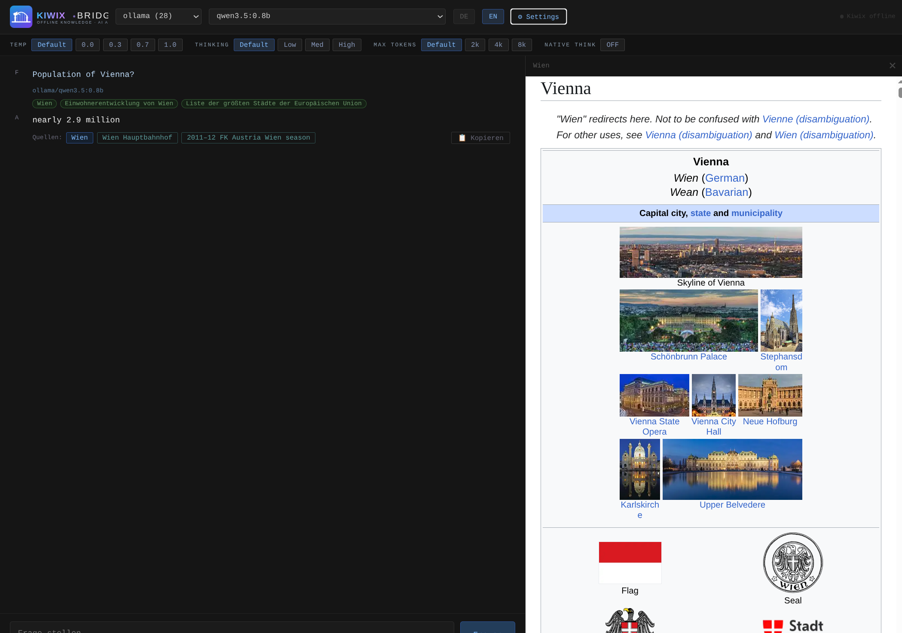

# 🐦‍🔥 KIWIX_BRIDGE


> **Wikipedia's facts + AI's intelligence — fully offline, brutally accurate.**
>
> Ask any question — KIWIX BRIDGE finds the right Wikipedia articles, feeds them to the AI, and returns a precise answer with clickable citations. 📚
> Works with any model: local Ollama, cloud providers, or reasoning models with thinking output. ⚙️
> No hallucinations — every answer is grounded in real Wikipedia content retrieved from your local Kiwix server. 🎯

Even the smallest local models can answer complex factual questions with precision — because they don't have to *know* the answer, they just have to *read* it. KIWIX BRIDGE fetches the right Wikipedia articles first, then lets the AI reason over them. No hallucinations. Just facts. 🎯

---

## 🦙 Zero config local OLLAMA + optional cloud all providers LITELLM

**No API key needed to get started.** Install [Ollama](https://ollama.com), pull any model, and KIWIX BRIDGE auto-discovers it at startup — all local models appear in the provider dropdown automatically. No config, no keys, no internet. 🏠

For cloud providers, add your API keys to `.env` — every provider you add is auto-detected and all its models appear in the dropdown instantly.

Everything goes through **[LiteLLM](https://github.com/BerriAI/litellm)** — a universal adapter that makes every model, local or cloud, speak the same interface. [Kilocode](https://kilo.ai) is integrated on top to further expand the available model roster beyond LiteLLM's built-in providers. 🔌

The `Native Think` toggle in Settings captures `<think>` reasoning output from thinking-capable models. 🧠

---

## 📖 What is Kiwix and what is KIWIX_BRIDGE?

[Kiwix](https://www.kiwix.org/) is an **offline encyclopedia reader** — it downloads Wikipedia in any language and serves it locally as a fast HTTP server. No internet required. No rate limits. No censorship.

KIWIX_BRIDGE connects to your local Kiwix instance and uses it as a **knowledge retrieval engine**. It auto-detects all available ZIM books and lists them in a dropdown — Wikipedia in any language, or any other offline encyclopedia you have installed.

```
Your Question
     │
     ▼
🤖 AI extracts 3 Wikipedia article titles
     │
     ▼
📚 Kiwix fetches those articles (offline, instant)
     │
     ▼
🧠 AI reads the articles and answers your question
     │
     ▼
✅ Precise answer + clickable Wikipedia citations
```

This is **RAG (Retrieval-Augmented Generation)** — but with your own local Wikipedia, no cloud. Suitable for parents to let children work offline with AI.

---

## ✨ Why it works even with small models

A tiny model running on your laptop doesn't need to memorize all of Wikipedia. It just needs to:
1. Know what to search for *(easy)*
2. Read 3 articles and extract the answer *(easy)*

This means even small Ollama models become genuinely useful for factual Q&A — grounded in real Wikipedia data, not hallucinations. 🔥

---

## 🚀 Installation

### 1. Prerequisites

- **Kiwix** running locally at `https://127.0.0.1:450/` with one or more ZIM files (Wikipedia, Wiktionary, or any other offline encyclopedia)
  - Download Kiwix: [kiwix.org/en/download](https://www.kiwix.org/en/download/)
  - Download ZIM files: [library.kiwix.org](https://library.kiwix.org/)
- **Python 3.9+**
- At least one of: API keys for cloud providers, or Ollama running locally

### 2. Clone & setup

```bash
git clone https://github.com/safrano9999/KIWIX_BRIDGE.git
cd KIWIX_BRIDGE
python3 bin/setup.py
```

This creates a local `venv/` and installs all dependencies.

### 3. Configure Kiwix URL

Edit **`kiwix.conf`** and adapt `KIWIX_URL` to your Kiwix server.

### 4. Configure AI providers

Copy `.env.example` to `.env` and add your API keys.

### 5. Run

```bash
python bin/web.py
```

Open [http://127.0.0.1:7710](http://127.0.0.1:7710) in your browser — port configurable via `WEB_PORT` in `kiwix.conf`.

---

## 🔑 Configuration (`.env`)

Add API keys for the cloud providers you want to use. All providers are **auto-detected** — no extra config, just add the keys you have. Ollama needs no key at all.

---


## 🏗️ Tech Stack

- **Flask** — lightweight Python web server
- **LiteLLM** — unified API for all LLM providers
- **Kiwix HTTP API** — local Wikipedia search & article fetch
- **BeautifulSoup** — HTML → clean article text
- **SSE streaming** — real-time token streaming in the browser
