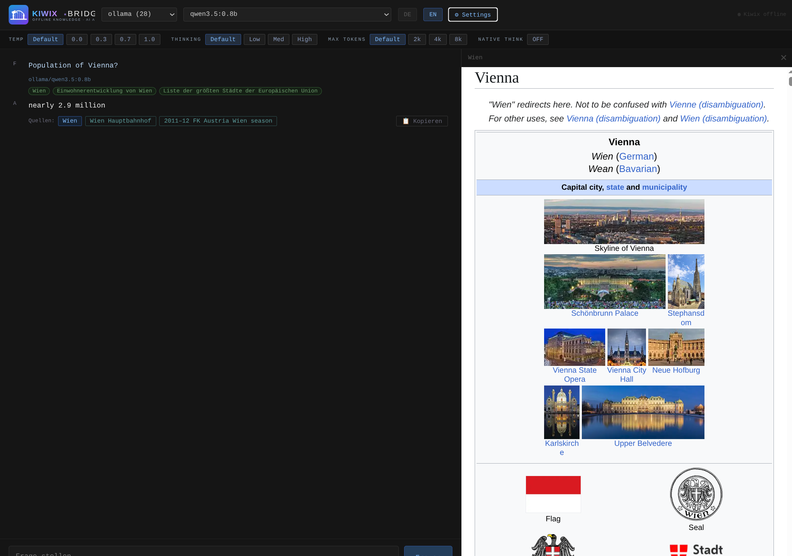

# 🐦‍🔥 KIWIX_BRIDGE


> **Wikipedia's facts + AI's intelligence — fully offline, brutally accurate.**
>
> Ask any question — KIWIX BRIDGE finds the right Wikipedia articles, feeds them to the AI, and returns a precise answer with clickable citations. 📚
> Works with any model: local Ollama, cloud providers, or reasoning models with thinking output. ⚙️
> No hallucinations — every answer is grounded in real Wikipedia content retrieved from your local Kiwix server. 🎯

Even the smallest local models can answer complex factual questions with precision — because they don't have to *know* the answer, they just have to *read* it. KIWIX BRIDGE fetches the right Wikipedia articles first, then lets the AI reason over them. No hallucinations. Just facts. 🎯

---

## 🦙 LiteLLM proxy + local Kiwix

KIWIX_BRIDGE talks to an OpenAI-compatible **LiteLLM proxy**. The app does not use the LiteLLM Python SDK anymore; it uses the official `openai` client against `/v1/chat/completions` and `/v1/models`.

Runtime configuration follows the safrano9999 pattern:
- secrets and bearer tokens live in `.env`, generated from `env.example`
- non-secret runtime settings live in `config.conf`, generated from `config.conf_example`
- `config.sh` prompts and merges values
- `python_header.py` loads `config.conf`, `.env`, and injected process environment in one place

The `Native Think` toggle in Settings captures `<think>` reasoning output from thinking-capable models. 🧠

---

## 📖 What is Kiwix and what is KIWIX_BRIDGE?

[Kiwix](https://www.kiwix.org/) is an **offline encyclopedia reader** — it downloads Wikipedia in any language and serves it locally as a fast HTTP server. No internet required. No rate limits. No censorship.

KIWIX_BRIDGE connects to your local Kiwix instance and uses it as a **knowledge retrieval engine**. It auto-detects all available ZIM books and lists them in a dropdown — Wikipedia in any language, or any other offline encyclopedia you have installed.

```
Your Question
     │
     ▼
🤖 AI extracts 3 Wikipedia article titles
     │
     ▼
📚 Kiwix fetches those articles (offline, instant)
     │
     ▼
🧠 AI reads the articles and answers your question
     │
     ▼
✅ Precise answer + clickable Wikipedia citations
```

This is **RAG (Retrieval-Augmented Generation)** — but with your own local Wikipedia, no cloud. Suitable for parents to let children work offline with AI.

---

## ✨ Why it works even with small models

A tiny model running on your laptop doesn't need to memorize all of Wikipedia. It just needs to:
1. Know what to search for *(easy)*
2. Read 3 articles and extract the answer *(easy)*

This means even small Ollama models become genuinely useful for factual Q&A — grounded in real Wikipedia data, not hallucinations. 🔥

---

## 🚀 Installation

### 1. Prerequisites

- **Kiwix** running locally at your host for example at `https://127.0.0.1:450/` with one or more ZIM files (Wikipedia, Wiktionary, or any other offline encyclopedia)
  - Download Kiwix: [kiwix.org/en/download](https://www.kiwix.org/en/download/)
  - Download ZIM files: [library.kiwix.org](https://library.kiwix.org/)
- **Python 3.9+**
- **LiteLLM proxy** reachable via `LITELLM_URL` / `LITELLM_PORT`

### 2. Clone & setup

```bash
git clone https://github.com/safrano9999/KIWIX_BRIDGE.git
cd KIWIX_BRIDGE
python3 bin/setup.py
./config.sh
```

This creates a local `venv/` and installs all dependencies.

### 3. Configure runtime

`./config.sh` writes:

- `.env` from `env.example` for `LITELLM_API_KEY`
- `config.conf` from `config.conf_example` for `KIWIX_URL`, `KIWIX_BRIDGE_PORT`, `LITELLM_URL`, and `LITELLM_PORT`

Default WebUI port is `11008`, with matching container publish convention:

```bash
KIWIX_BRIDGE_PORT=11008
KIWIX_BRIDGE_PUBLISH_PORT=11008
```

### 4. Run

```bash
python3 bin/web.py
```

Open [http://127.0.0.1:11008](http://127.0.0.1:11008) in your browser.

---


## 📁 Project structure

```
KIWIX_BRIDGE/
├── bin/
│   ├── setup.py          # One-time installer — creates venv + installs dependencies
│   ├── web.py            # Main app — Flask web UI, run this to start
│   ├── chat.py           # Alternative CLI chat (terminal only, no browser needed)
│   ├── llm_proxy.py      # OpenAI client against the LiteLLM proxy
│   └── kiwix_tool.py     # Internal library — not meant to be run directly
├── static/               # Logo / icon assets for the web UI
├── env.example           # Secret prompts for .env
├── config.conf_example   # Non-secret runtime config prompts
├── config.sh             # Shared safrano9999 config generator
├── python_header.py      # Shared config/env loader
├── SKILLS.md             # System prompts and keyword extraction prompt (editable)
└── requirements.txt      # Python dependencies
```

### `web.py` — the main interface ⭐ start here

**This is the main program.** Run it, then open `http://127.0.0.1:11008` in your browser.

A Flask web app that uses a **RAG pipeline**:
1. Extracts 3–5 Wikipedia search keywords from your question (via LLM)
2. Fetches matching articles from your local Kiwix server
3. Streams the LLM answer grounded in those articles, with clickable citations

Models are loaded from the LiteLLM proxy `/v1/models` endpoint through the OpenAI-compatible client.

### `chat.py` — terminal alternative

An interactive CLI chat. Same idea, but uses **function calling** instead of RAG: the LLM decides on its own when to look something up in Wikipedia. No browser, no Flask — just type and get answers in the terminal. Useful for quick queries or environments without a browser.

### `kiwix_tool.py` — internal library

Handles all communication with the Kiwix server: article discovery, search, direct title lookup, intro text extraction, and scoring/deduplication of results. Imported by both `web.py` and `chat.py` — you don't run this directly.

---

## 🏗️ Tech Stack

- **Flask** — lightweight Python web server
- **OpenAI Python client** — OpenAI-compatible calls to the LiteLLM proxy
- **Kiwix HTTP API** — local Wikipedia search & article fetch
- **BeautifulSoup** — HTML → clean article text
- **SSE streaming** — real-time token streaming in the browser
